

  

  <b>Access your music library on all your android devices</b>

    
    
    

**Tempo** is an open-source and lightweight music client for Subsonic, designed and built natively for Android. It provides a seamless and intuitive music streaming experience, allowing you to access and play your Subsonic music library directly from your Android device. 

Tempo does not rely on magic algorithms to decide what you should listen to. Instead, the interface is built around your listening history, randomness, and optionally integrates with services like Last.fm to personalize your music experience.

**If you find Tempo useful, please consider starring the project on GitHub. It would mean a lot to me and help promote the app to a wider audience.**

## Features
- **Subsonic Integration**: Tempo seamlessly integrates with your Subsonic server, providing you with easy access to your entire music collection on the go.
- **Sleek and Intuitive UI**: Enjoy a clean and user-friendly interface designed to enhance your music listening experience, tailored to your preferences and listening history.
- **Browse and Search**: Easily navigate through your music library using various browsing and searching options, including artists, albums, genres, playlists, decades and more.
- **Streaming and Offline Mode**: Stream music directly from your Subsonic server. Offline mode is currently under active development and may have limitations when using multiple servers.
- **Playlist Management**: Create, edit, and manage playlists to curate your perfect music collection.
- **Gapless Playback**: Experience uninterrupted playback with gapless listening mode.
- **Chromecast Support**: Stream your music to Chromecast devices. The support is currently in a rudimentary state.
- **Scrobbling Integration**: Optionally integrate Tempo with Last.fm to scrobble your played tracks, gather music insights, and further personalize your music recommendations, if supported by your Subsonic server.
- **Podcasts and Radio**: If your Subsonic server supports it, listen to podcasts and radio shows directly within Tempo, expanding your audio entertainment options.
- **Transcoding Support**: Activate transcoding of tracks on your Subsonic server, allowing you to set a transcoding profile for optimized streaming directly from the app. This feature requires support from your Subsonic server.

    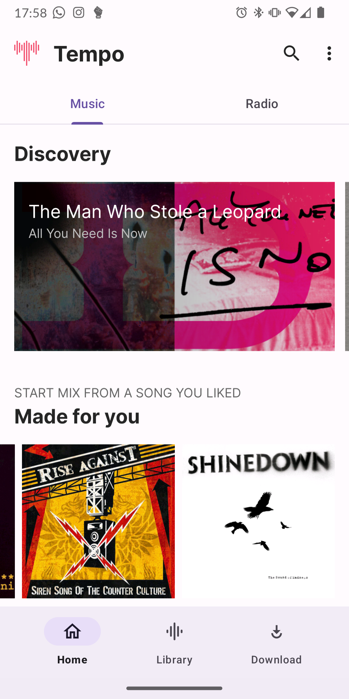
    
    
    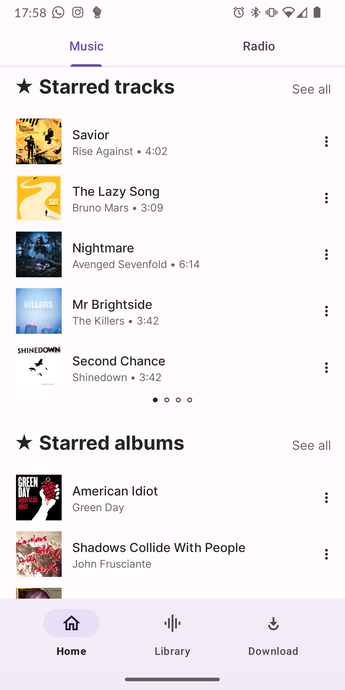
    
    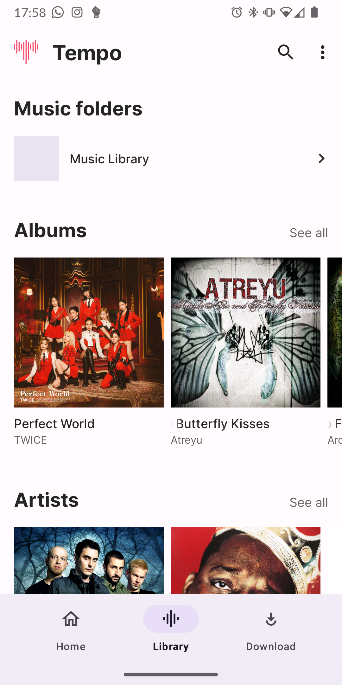
    
    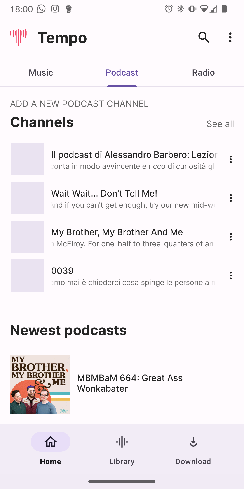

## Sponsors
Tempo is an open-source project developed and maintained solely by me. I would like to express my heartfelt thanks to all the users who have shown their love and support for Tempo. Your contributions and encouragement mean a lot to me, and they help drive the development and improvement of the app.

If you would like to sponsor the project and show your support, you can make a donation or contribution by visiting the [**sponsorship page**](https://www.buymeacoffee.com/a.cappiello). Your generosity will help cover the costs of development and further enhancements.

## Screenshot

  <b>Light theme</b>

    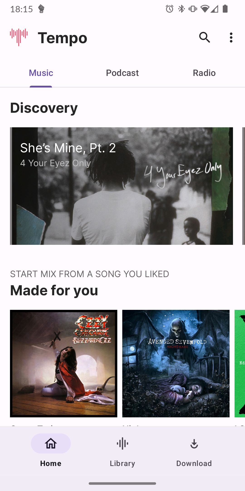
    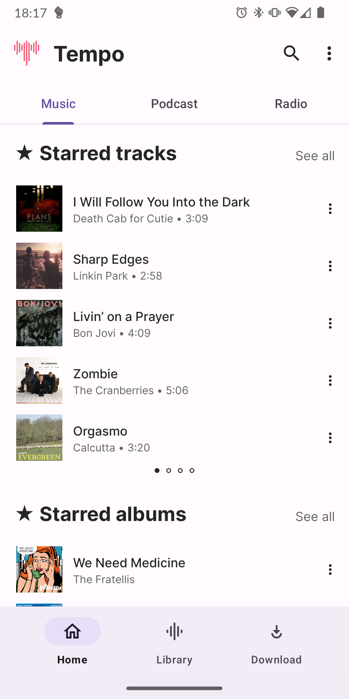
    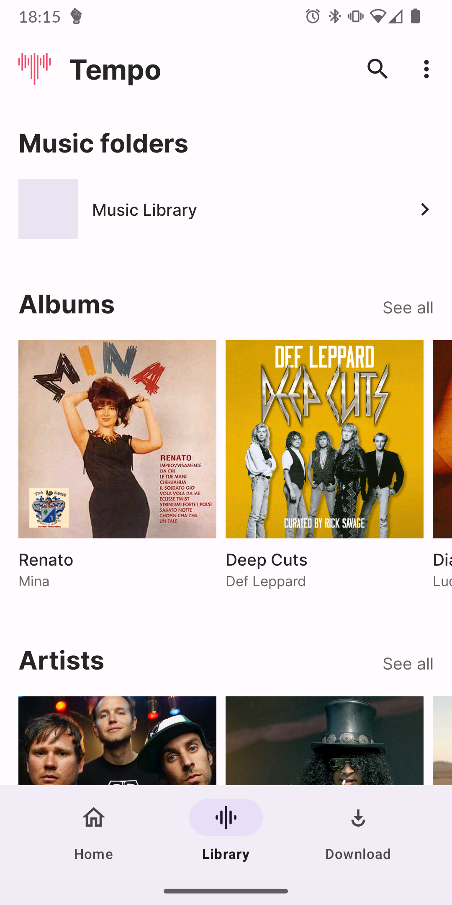
    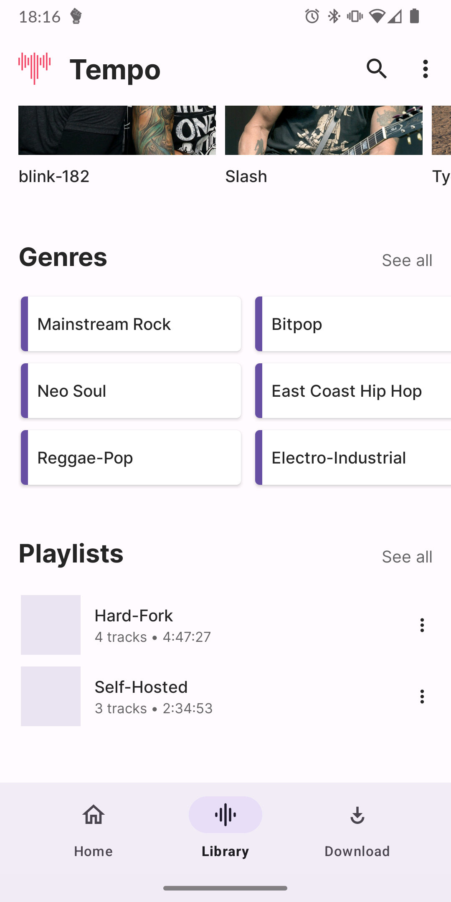
    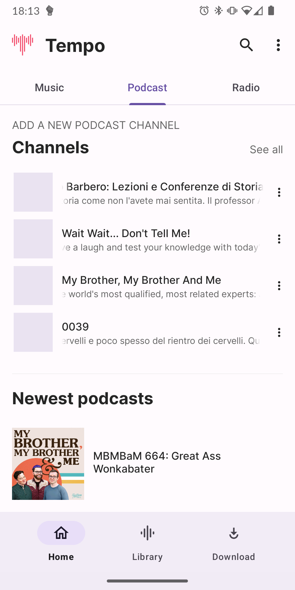
    
    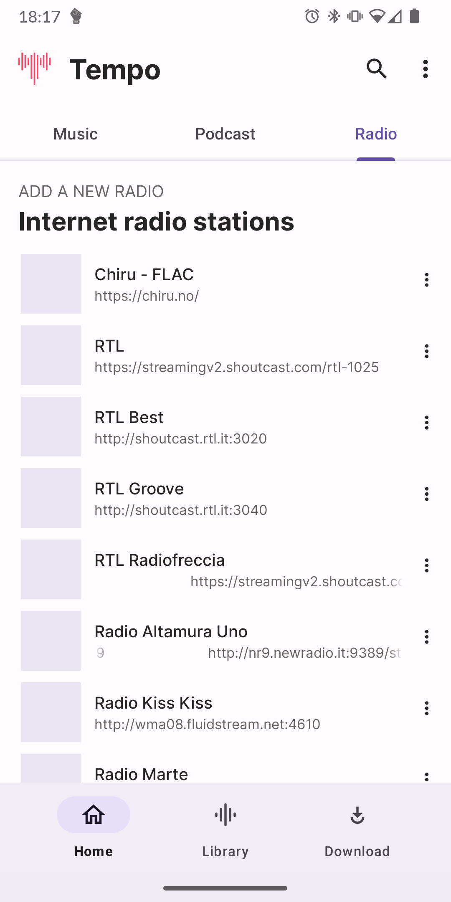
    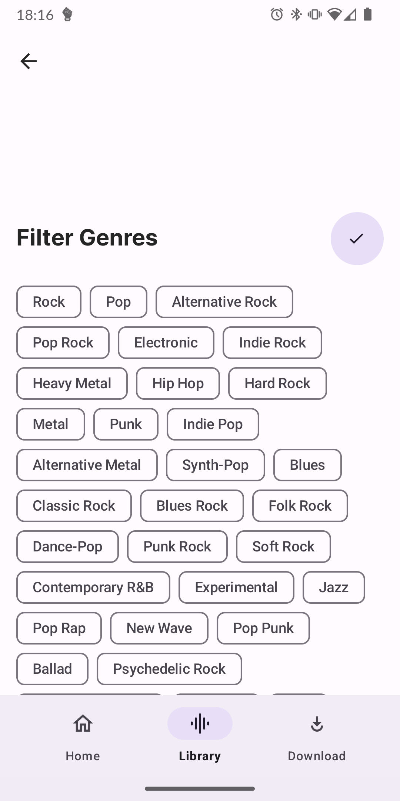

 

  <b>Dark theme</b>

    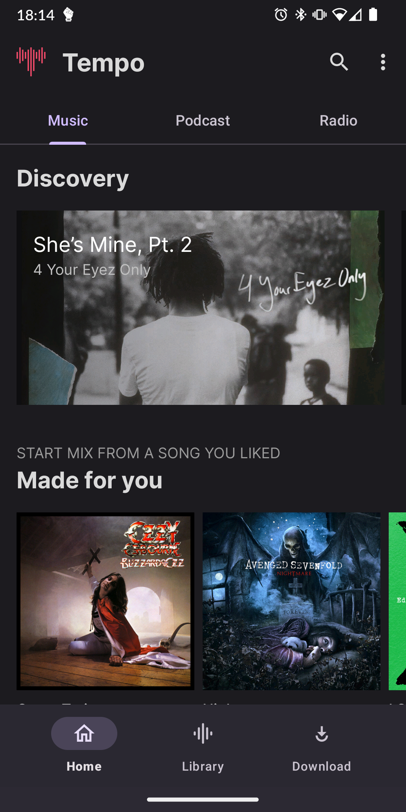
    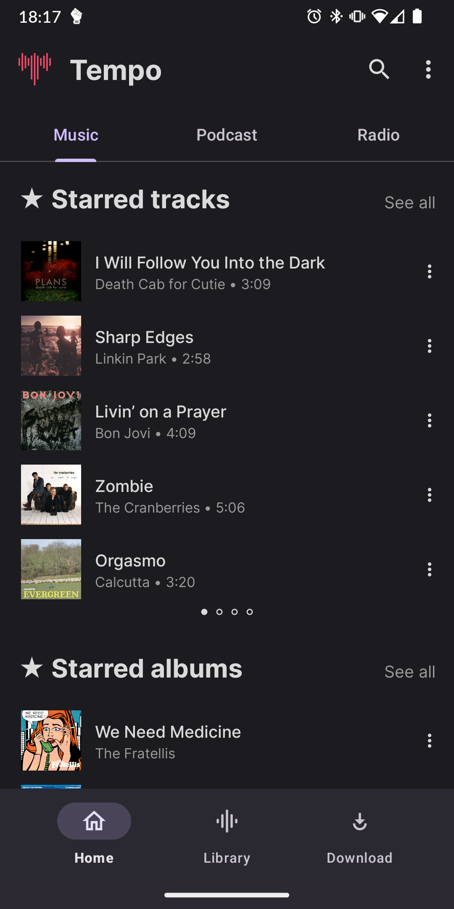
    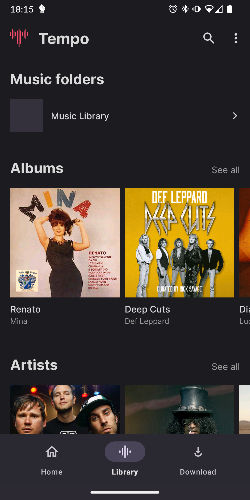
    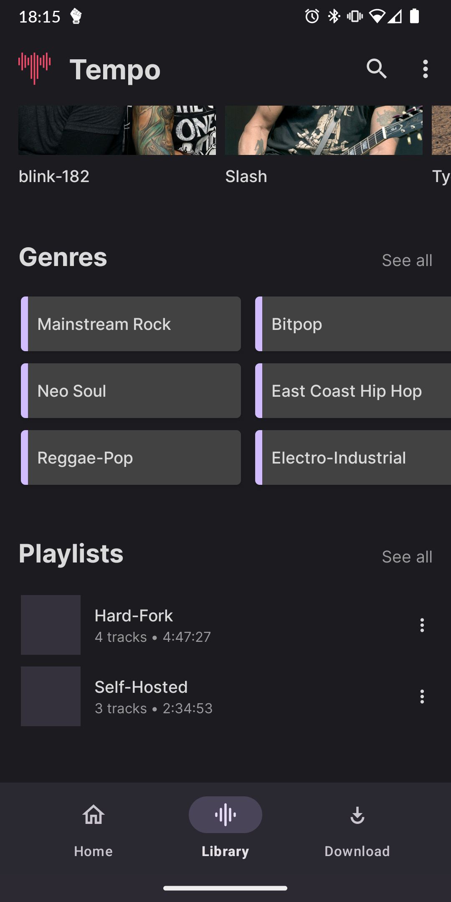
    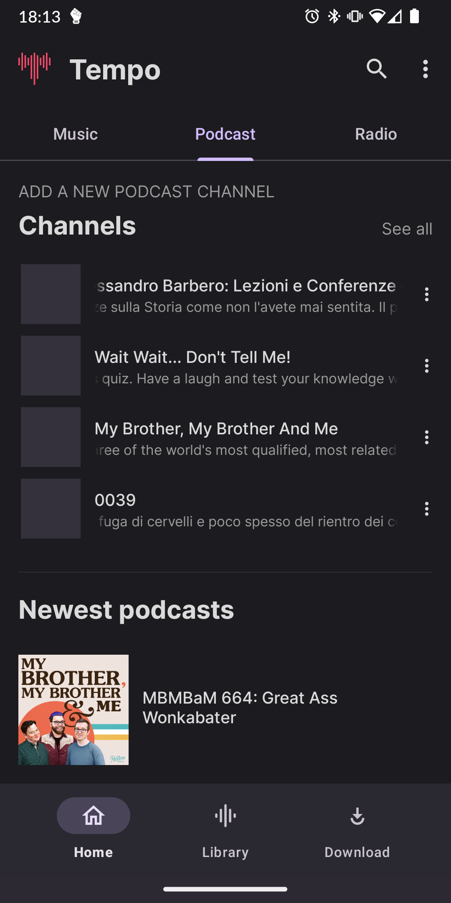
    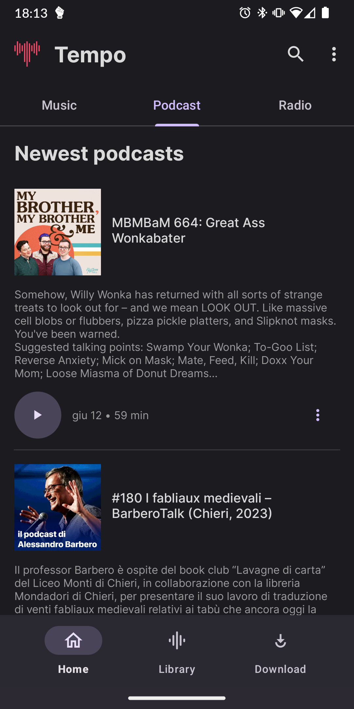
    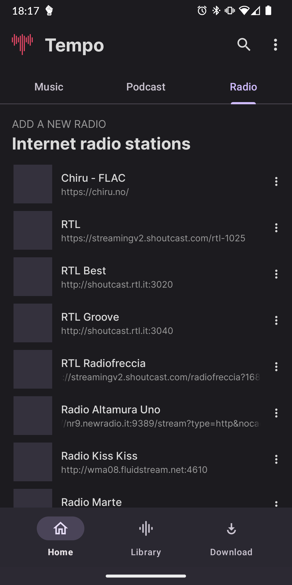
    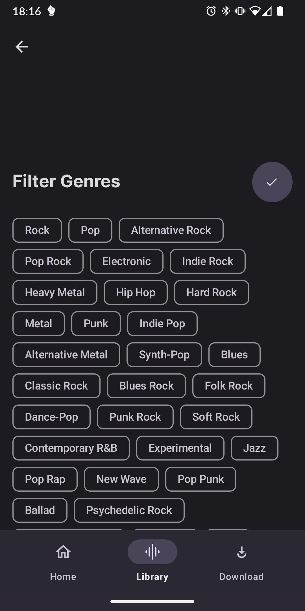

## License

Tempo is released under the [GNU General Public License v3.0](LICENSE). Feel free to modify, distribute, and use the app in accordance with the terms of the license. Contributions to the project are also welcome. 
